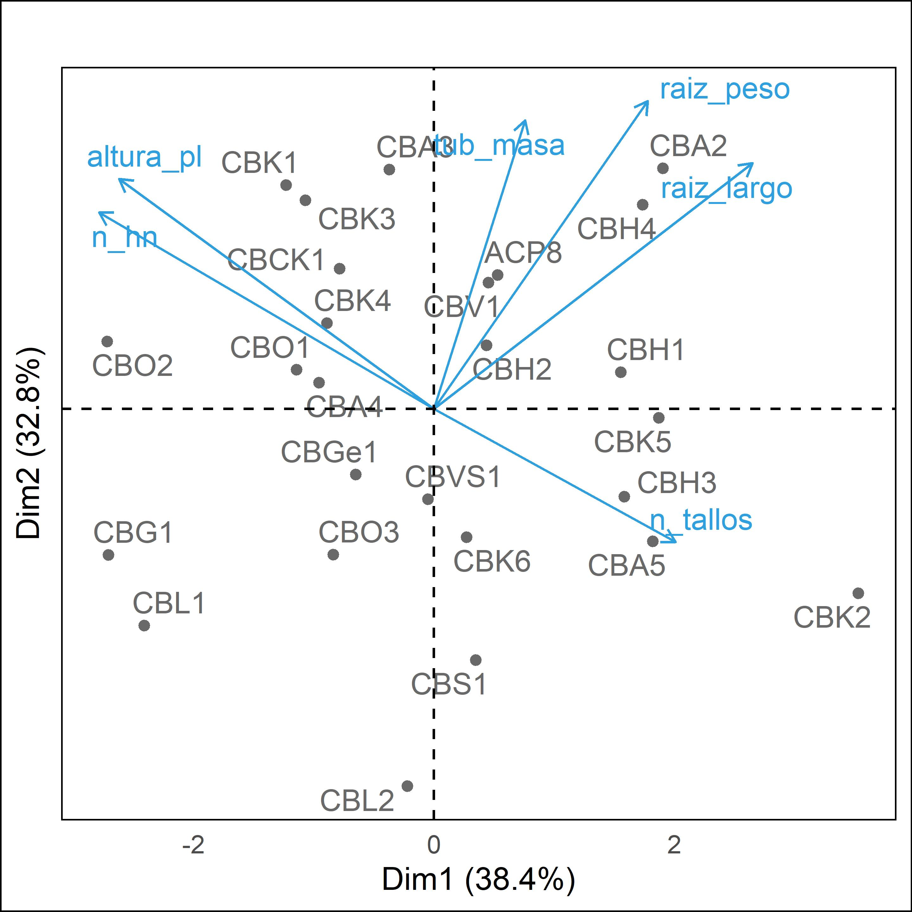
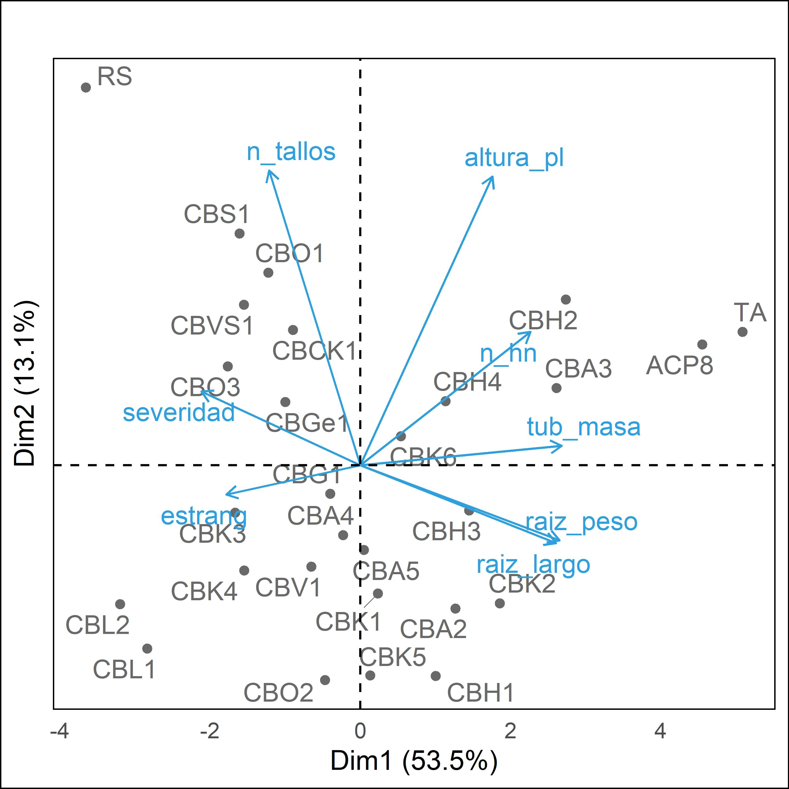
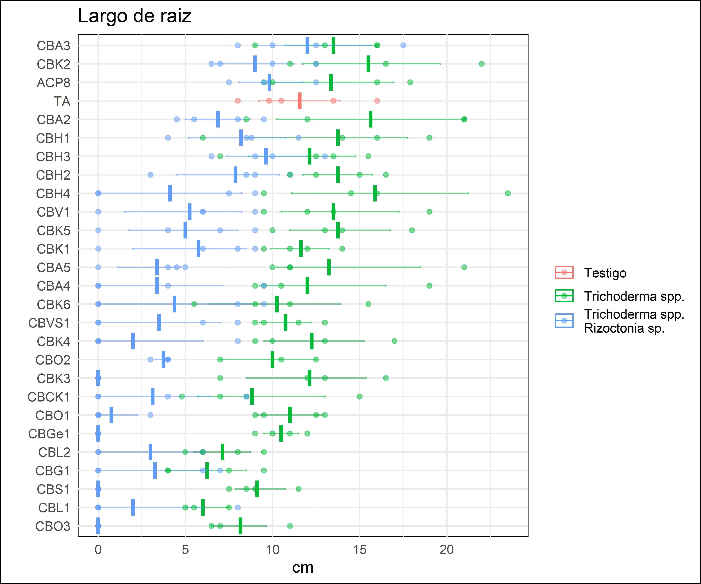
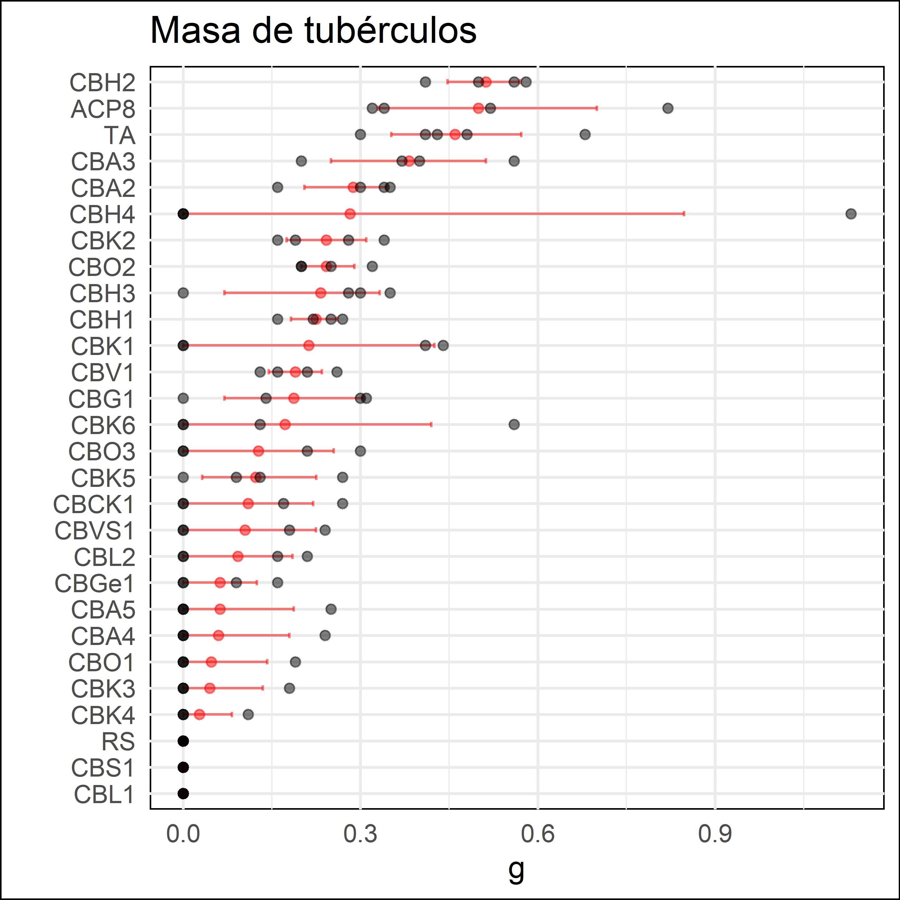
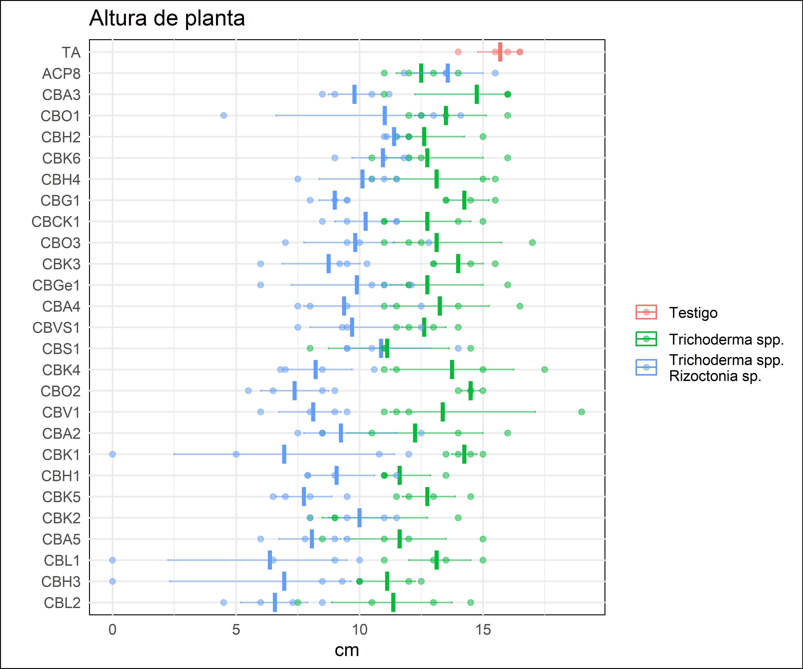
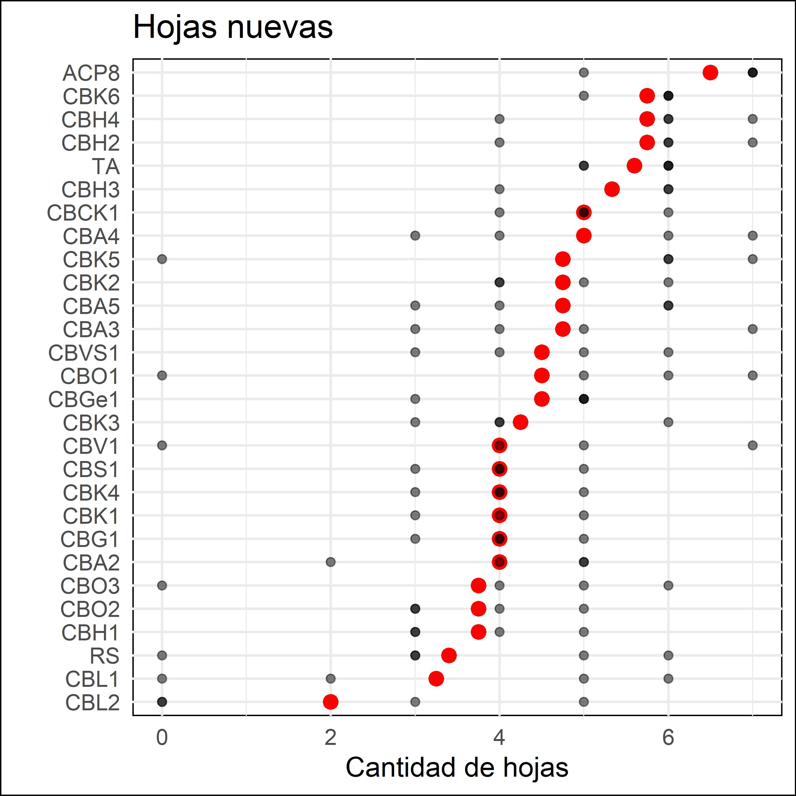

# Morfologia 

## Tricho solo

```{r}
tric_morfo <- raw %>% #count(tipo)
  filter(str_detect(tricho, "si"), rhizo=="no") %>% 
  mutate(tub_masa = tub_peso*tub_n, .keep = "unused") %>% 
  group_by(tipo, cepa, tricho, rhizo) %>%
  summarise_all(funs(mean), na.rm = TRUE) %>% 
  ungroup() %>% 
  select(cepa, contains("_"), -tricho_rhizo 
         # -rep, -tipo, -tricho, -rhizo, -(ABA:KIN)
         ) %>% 
  column_to_rownames(var = "cepa") %>% 
  round(3) 

tric_morfo  %>% 
  rownames_to_column("cepa") %>% 
  as_hux() %>% 
  set_font_size(9) %>%  
  theme_article() -> tric_morfo_tab

number_format(tric_morfo_tab)[, -1] <- 1 
number_format(tric_morfo_tab)[, -1] <- fmt_pretty()

tric_morfo_tab
```

- Biplot 

```{r, results='hide', fig.cap="trico_morfo_biplot"}
trico_morfo_pca <- PCA(tric_morfo, scale.unit=TRUE, ncp=5, graph=F)
trico_morfo_biplot <- fviz_pca_biplot(
  trico_morfo_pca, 
  repel = TRUE,
  col.var = "#2E9FDF", # Variables color
  col.ind = "#696969") + 
  labs(title="") + 
  theme_biplot
trico_morfo_biplot
```

```{r, eval=FALSE}
trico_morfo_biplot %>% 
  ggsave(filename = "plots/trico_morfo_biplot.jpg", width = 4, height = 4, scale=1.2, dpi = 600)
```



## Tricho x Rhizo 

```{r}
rhiz_morfo <- raw %>% #count(tipo)
  filter(str_detect(cepa, ("TA|RS"))|(tricho== "si" & rhizo=="si")) %>%
  mutate(tub_masa = tub_peso*tub_n, .keep = "unused") %>% 
  group_by(cepa, tricho, rhizo) %>%
  summarise(
    across(contains("_"), ~ mean(.x, na.rm = TRUE)), 
    across(severidad, ~ mean(.x, na.rm = TRUE)), 
    across(estrang, ~ sum(.x, na.rm = TRUE)/sum(!is.na(.x)))
    ) %>% 
  # summarise(across(funs(mean), na.rm = TRUE) %>% 
  ungroup() %>% 
  select(cepa, estrang, severidad, contains("_"), -tricho, -rhizo, -tricho_rhizo) %>% 
  column_to_rownames(var = "cepa") %>% 
  # round(3) %>% 
  drop_na()  
  
rhiz_morfo %>% 
  rownames_to_column("cepa") %>% 
  as_hux() %>% 
  set_font_size(9) %>%  
  theme_article() -> rhiz_morfo_tab
number_format(rhiz_morfo_tab)[, -1] <- 1 
number_format(rhiz_morfo_tab)[, -1] <- fmt_pretty()
rhiz_morfo_tab
```

- Biplot 

```{r, results='hide', fig.cap="biplot_rhiz_morfo"}
rhiz_morfo_pca <- PCA(rhiz_morfo, scale.unit=TRUE, ncp=5, graph=F)
# summary(rhiz_morfo_pca)
```


```{r, eval=FALSE}
biplot_rhiz_morfo <- fviz_pca_biplot(
  rhiz_morfo_pca, repel = TRUE,
  col.var = "#2E9FDF", # Variables color
  col.ind = "#696969") +   
  labs(title="") + 
  theme_biplot
biplot_rhiz_morfo
```


```{r, eval=FALSE}
biplot_rhiz_morfo %>% 
  ggsave(filename = "plots/rhiz_morfo_biplot.jpg", width = 4, height = 4, scale=1.2, dpi = 600)
```



- Dendro

```{r, results='hide', fig.cap="dendro_rhiz_morfo"}
dendro_rhiz_morfo <- rhiz_morfo %>% 
  dist %>% hclust %>% as.dendrogram %>%
  set("branches_k_color", k = 5) %>% 
  set("labels_cex", 0.6) %>% 
  set("labels_colors", k = 5) %>%
  set("branches_lwd", .5) %>%
  as.ggdend( ) %>%
  ggplot(horiz=TRUE, 
         offset_labels = -1.5) + 
  theme_minimal(12) +
  labs(x = "", 
       y = "Distancia Euclideana") +
  scale_y_continuous(position = "left") + 
  theme_dendro
dendro_rhiz_morfo
```

```{r, eval=FALSE}
ggsave(plot=dendro_rhiz, filename = "plots/rhiz_morfo_dendro.jpg", 
       width = 4, height = 4, scale=1.2, dpi = 600)
```


### Subterranea

```{r}
rhiz <- raw %>%  
  select(-tricho_rhizo) %>% 
  filter(str_detect(cepa, ("TA|RS"))|(tricho== "si" & rhizo=="si")) %>% 
  mutate(tub_masa = tub_peso*tub_n, .keep = "unused")   %>% 
    mutate(cepa = fct_relevel(cepa, "TA")) 
# rhiz
```

#### raiz_largo

```{r, eval=FALSE}
rhiz %>%   
  drop_na(raiz_largo) %>% 
  ggplot()+
  aes(x = reorder(cepa, raiz_largo, FUN=median), y = raiz_largo) +  
  stat_summary(fun="median", col="red")+
  geom_point(alpha=.5)+
  coord_flip() +
  theme_uni +
  labs(x="", y ="Largo de raiz")
```

```{r, eval=FALSE}
ggsave(plot=last_plot(), filename = "plots/rhizo_raiz_largo.jpg", width = 4, height = 4, scale=1.2, dpi = 600)
```



#### raiz_peso

```{r, eval=FALSE}
rhiz %>%
  # mutate(tub_masa = tub_peso*tub_n, .keep = "unused") %>%   
  drop_na(raiz_largo) %>% 
  ggplot()+
  aes(x = reorder(cepa, raiz_peso, FUN=mean), y = raiz_peso) +  
  stat_summary(fun="mean", col="red")+
  geom_point(alpha=.5)+
  coord_flip() +
  theme_uni +
  labs(x="", y ="Peso de raiz")
```

```{r, eval=FALSE}
ggsave(plot=last_plot(), filename = "plots/raiz_peso.jpg", width = 4, height = 4, scale=1.2, dpi = 600)
```


#### tub_masa

```{r, eval=FALSE}
rhiz %>%
  drop_na(tub_masa) %>% 
  # filter(cepa=="CBH4")
  ggplot()+
  aes(x = reorder(cepa, tub_masa, FUN=median), y = tub_masa) +  
  stat_summary(fun="median", col="red")+
  geom_point(alpha=.5)+
  coord_flip() +
  theme_uni +
  labs(x="", y = "g", title="Masa de tubérculos")
```

```{r, eval=FALSE}
ggsave(plot=last_plot(), filename = "plots/rhizo_masa_tuber.jpg", width = 4, height = 4, scale=1.2, dpi = 600)
```



```{r}
mod_masa <- lm(sqrt(tub_masa+0.1) ~ cepa, rhiz)
performance::check_normality(mod_masa)
performance::check_heteroscedasticity(mod_masa)
masa_dun <- DunnettTest(x=rhiz$tub_masa, g=rhiz$cepa)
masa_dun$TA %>% as.data.frame %>% 
  arrange(pval) %>% 
  mutate(dif_TA=if_else(pval < 0.1, "si", "no")) %>% 
  rownames_to_column("cepa")
```

### Aerea

#### severidad

```{r, eval=FALSE}
rhiz %>%
  ggplot()+
  aes(x = reorder(cepa, -severidad, FUN=mean), y = severidad) +  
  stat_summary(fun="mean", col="red")+
  geom_point(alpha=.5)+
  coord_flip() +
  theme_uni +
  labs(x="", y= "Escala 1 a 5", title = "Severidad de rhizoctoniasis")
```

```{r, eval=FALSE}
ggsave(plot=last_plot(), filename = "plots/severidad.jpg", width = 4, height = 4, scale=1.2, dpi = 600)
```

#### altura_pl

```{r, eval=FALSE}
rhiz %>%
  ggplot()+
  aes(x = reorder(cepa, altura_pl, FUN=mean), y = altura_pl) +  
  stat_summary(fun="mean", col="red")+
  geom_point(alpha=.5)+
  coord_flip() +
  theme_uni +
  labs(x="", y ="Altura de planta")
```

```{r, eval=FALSE}
ggsave(plot=last_plot(), filename = "plots/altura_pl.jpg", width = 4, height = 4, scale=1.2, dpi = 600)
```



#### n_hj

```{r, eval=FALSE}
rhiz %>%
  drop_na(n_hn) %>% 
  ggplot()+
  aes(x = reorder(cepa, n_hn, FUN=mean), y = n_hn) +  
  stat_summary(fun="mean", col="red")+
  geom_point(alpha=.5)+
  coord_flip() +
  theme_uni +
  labs(x="", title = "Hojas nuevas", y = "Cantidad de hojas")
```

```{r, eval=FALSE}
ggsave(plot=last_plot(), filename = "plots/hj_nuevas.jpg", width = 4, height = 4, scale=1.2, dpi = 600)
```


